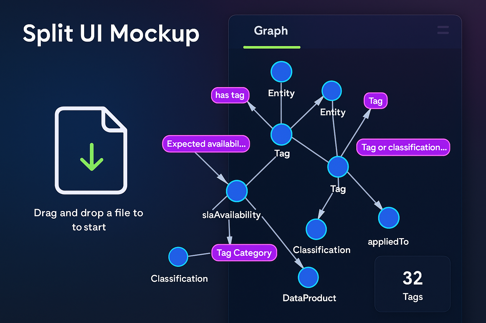

# RDF Visualizer

<p align="center">
  
  
</p>

React + Vite RDF visualizer that turns Turtle files into an interactive graph and searchable triple table. Supports drag-and-drop uploads or bundled samples, highlighting resources vs. literals with vis-network, and adds node/predicate filtering plus relationship statistics for quick analysis. Built with TypeScript strict mode, pnpm, and Vitest coverage for the parsing pipeline.

## Features
- Drag-and-drop Turtle files (or load a bundled sample) for instant parsing via `n3`.
- Zoomable, pannable network rendered with `vis-network`, highlighting resources vs. literals.
- Graph Explorer search filters nodes and predicates so you only see relationships connected to the term you care about.
- Relationship Analysis tab with triple counts, search, and quick stats.

## Prerequisites
- Node.js 18+ (use `nvm install 20 && nvm use 20` to isolate per-shell).
- `pnpm` (recommended). Enable via Corepack: `corepack enable pnpm`.

## Installation
```bash
cd rdf-visualizer
pnpm install
```
All dependencies stay inside `node_modules/` in this repo; nothing is installed globally.

## Development
```bash
pnpm dev
```
- Starts Vite dev server at `http://localhost:5173/` with hot reload.
- Use the "Load sample graph" button for a quick demo if you do not have a `.ttl` handy.

## Production Build
```bash
pnpm build
pnpm preview   # optional: serve the built app
```
- `pnpm build` runs TypeScript checks and creates `dist/`.
- `pnpm preview` hosts the production bundle on a local server for QA.

## Testing
```bash
pnpm test
```
Runs the Vitest suite (currently covering Turtle parsing). Add new tests under `src/**/*.test.ts(x)`.

## Project Structure
```
src/
  App.tsx              # Tab layout, uploader, shared state
  components/          # FileDropzone, GraphView, AnalysisPanel
  utils/               # ttlParser, sample TTL, tests
  styles/              # global and app-level styling
```

## Conventions
- TypeScript strict mode, React 18 function components, 2-space indentation.
- Run `pnpm build` before pushing to ensure type + bundler checks pass.
